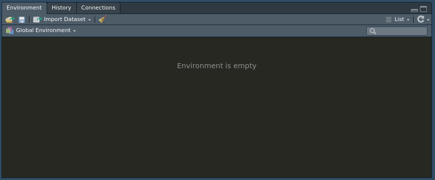
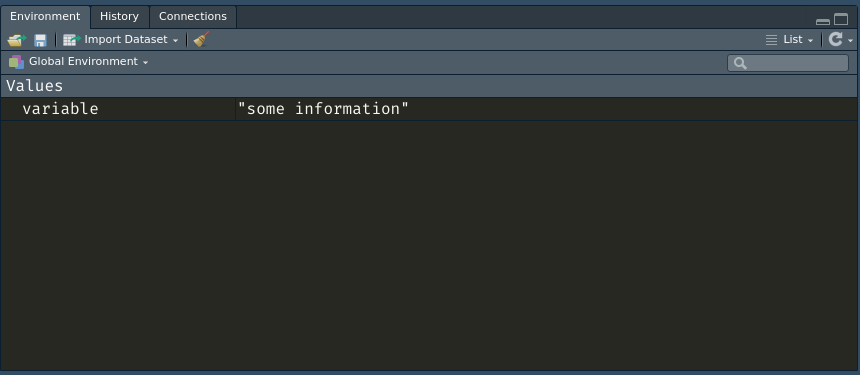
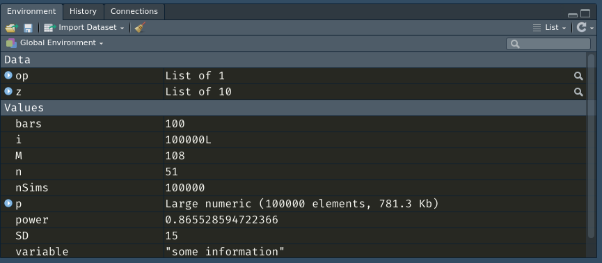
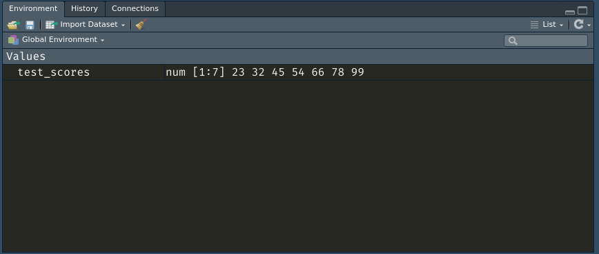
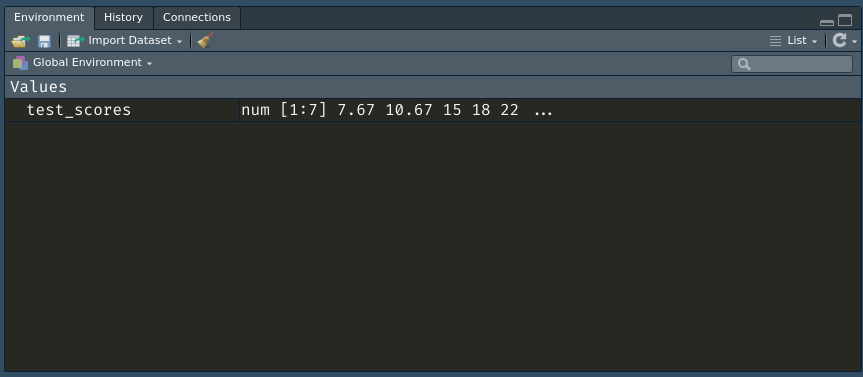
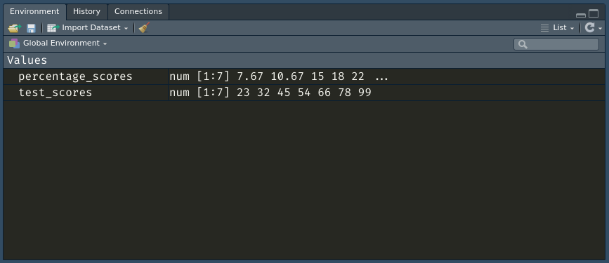

# ARM Additional Help: Variables & Loops

Variables and loops have been explained in the textbook chapter excerpt provided by Dr.Baker, and you will all have been using them in the practical and VLE assessments. During the first open session, quite a few students needed help with getting a better understanding of them and often seemed to lack a grasp of the core concept of how these things work. I hope to help with this with a practical and conceptual tour of what you're doing when you're programming. 

## The R environment

In psychology, we're taught very early about the working memory system, and its relationship with other faculties in our brains- most critically, our long term memory. To be honest, this analogy is quite close to the truth with our programs in R as well. Let's take a look at the environment when we first open R(Studio) (assuming you are not loading a previously used environment). 

 

This blank state is the ideal starting point for any program that we write, and later I will demonstrate why you want to keep strong supervision of what's going on in your environment. 

##### Different memory systems

When we do absolutely *anything* with data in R, we will usually want to consider how (or even if) we wish to store this information. The mysterious and very fluid machinations of our human memory systems cannot be taken for granted when working with computers. Computers are stupid, and need to be told exactly what to do, which they will execute very literally to the letter. 

"Why are you telling me this, I thought we were going over variables and loops?" You might ask. The truth is that any variable and any loop that you use might eventually end up here, and much like in real life, if one has a messy environment, one will produce messy and often incorrect results. Let's take a look at that now. 

## Think of variables as objects in memory 

Let's define a variable. 

```R
variable <- "some information"
```

Here, we have a variable we've mindlessly named, which contains the words "some information." You should already be familiar with what this is, but what *is* going on here? 

First of all, the idea of 'variables' can be a little abstract for those of you that have never programmed before. In general, we can view them as an object, or piece of information, just like we model for items of information in your brain in psychology. Variables in programming languages like R can hold any piece of information like text or numbers, or a container that has a collection of text or numbers. In the example above, ```variable``` will be some text (commonly referred to as a string). There are a lot of different variable types, and typing is important, but for now we will not worry about it. Finally, if you have any data (like a number for instance) but you provide it with no name, that is information that will not be stored in your environment. Depending on what it is you have, it might show up in your console after running that line. 

If we run the code above, you will already hopefully know that it will appear in our environment.



Everything I've shown you here so far should hopefully be very patronising and familiar to you. 

Here's the thing though, when we have long scripts as I'm sure you will while working through the practicals, you will be naming a laundry list of variables, data structures, and functions. They will all end up in this environment. As an example, here is how an environment might look after working for a while. 



This is an environment for an exercise from a different psychology statistics course I took. There are a few things we can take away from this, let's go through them quickly. 

##### **Variable Names**: 

We have some weird variable names going on here, which will make absolutely no sense to you. Even if you have done the course, some of these are a single letter and carry no information in their names, out of context. As you program, I earnestly believe you will all benefit from thinking about and using clear, informative, and memorable names for your variables. For instance, in my code here, ```i``` could easily have been named ```iterations``` which would allow me to remember easier that it holds the number of iterations for a simulation. Every time you encounter a variable name in code from the course, have a think about what it might mean (often this might unfortunately be impenetrable). The gold standard is if you can write some code, leave for a week and return to it immediately recognising what's what based on your clear names and structure (more on that later). 

##### **What happens when two variables have the same name?** 

Try working with me through this next part. Let's suppose I have some data. To make it simple, we'll pretend they're test scores. 

```R
test_scores <- c(23, 32, 45, 54, 66, 78, 99)
```

As you would expect, it looks like this in our environment:



Let's suppose that these scores are out of 300, and we want to compute their percentages in order to grade them. 

```R
test_scores <- test_scores/300 * 100
```

Let's see what changed in our environment:



We have our percentage scores... but the old data is gone. 

That's usually a bad thing. Often, we want to keep track of all the data we have, usually because we have to do lots of different things to the same data. 

But the key takeaway here is that you should be very careful about naming the same variables several times in your code. Every time a variable is defined again with the same name, you are overwriting whatever data it held previously. It's up to you to determine when this is desirable, but usually I can tell you that it isn't. 

Referring back to the previous point, it's also clear that what we have aren't just test scores, but rather some calculated percentages. So we can fix all these problems in one swoop: just give the new computed values an appropriate name. 

```R
percentage_scores <- test_scores/300 * 100
```



#### Avoid a messy environment

As you name more and more variables, this environment will get more and more packed. That means it'll become even more essential for you to be able to recognise all the things that you've asked the computer to remember and store in its working memory. A common problem we see in students just starting to learn how to programme is a tendency to keep naming, renaming, and copying variables. They might have arrived at the correct value they wanted at some point, but they will have accidentally overwritten, misnamed, or hidden the answer in their code. After programming for an hour, perhaps for a particularly difficult assessment, you want to know right before you submit your test that the numbers you got *really* were the right ones. That's much easier to do when you don't have a sprawling mess of variables that you have to make sure look 'right'. 

#### Your environment is fleeting

Remember, these environments are analogous to human working memory. Rather than the short temporal spans we hold information in working memory, computers will hold their R environments for so long as R is awake in its session. Actually, if you care, everything in your environment is stored in what we call volatile memory - the RAM in your computer. And it is cleared whenever the computer believes it is no longer needed, i.e. when you close RStudio. So, if you close R and don't save the environment, you will lose everything in there. You should therefore make sure you know how everything in your environment is produced and whether you might want to save anything. 

## Loops 

In programming, we will work with loops a *lot*. There are lots of different types with different names, but we are going to focus on the ```for``` loop. These encompass a broader aspect of logic and programming called control flow (for the one person that might be bored enough to look that up). 

Let's get one thing out of the way right now:

***The concept of loops is a bit abstract, so they are annoying to learn and master once, but will save you infinitely more time and trouble once you get what they do.***  My goal is to help you arrive at this point as reasonably fast as possible. 

This stuff might seem like a hassle, and I sympathise. But programming for most of us is just a tool- a very powerful tool that helps us get work done much faster and hopefully, more reliably. You can think of loops as a tool to automate all the boring stuff you'd otherwise have to do manually. Instead of copying and pasting the same thing 10 times, you can ask a program to do it in one go. 

Let's go back to our test scores. Suppose I didn't know about the convenient vectorised maths that R comes with. How might I compute the percentage score for each student without having to do it all manually? To motivate this problem, I will assume that my class has something unreasonable like a thousand students because I have been coerced into writing an online course.

```R
> test_scores <- abs(rnorm(1000, mean=150, sd=60))
> test_scores
   [1] 143.112418 140.930512 210.332717 100.851021 124.808646  83.096696  95.048288  25.957647
 ...
 [993] 133.417264 125.226781 256.434911 168.344808 136.540117 172.642963 211.656956  97.401499
```

For those curious, this code is simply generating a normal distribution with a mean score of 150, a standard deviation of 60, and then making sure every score is positive by taking the absolute with ```abs()```. 

Now, there is probably at least one person out there insane enough to try and compute the percentages for each one of these scores by hand. If you're clever, you might suggest something like putting this all into an excel sheet and doing it quickly there. I have some news for you: excel, and indeed pretty much anything you're using your computer to do, will use these loops to accomplish the task. 

#### How loops work

A ```for``` loop will take some data and go through every single individual item in that data, doing something with it each time. So in our case, we want to take each score, from our vector of 1000 scores, and do something for each score it iterates (goes over). 

Loops will be defined with syntax as follows:

```R
for(some_variable in some_data){
	do stuff
}
```

Here is how a loop might look for this task: 

```R
for(count in 1:length(test_scores)){
  percentage_score <- ((test_scores[count]/300)*100)
  print(percentage_score)
}
```

I remember finding this stuff very dense the first time I learnt about loops. Let's break down what's going on here just a little more. 

```count``` is a new variable that we have named in the process of defining this loop. Every time we define a loop, we will want to refer to the item that it's iterating over within our data. Here, our data is ```1:length(test_scores)``` which is, confusingly enough, a list that is counting from ```1 ``` all the way up until ```length(test_scores)```, which returns the number of items in ```test_scores``` (which is 1000). You can verify this yourselves by making a separate variable to see what ```1:length(test_scores)``` is like, and printing it. 

To make it clear, in this first line, we can easily translate it as saying *"for each number that we call ```count``` in the set of integers counting up from 1 to 1000..."* And then it will execute whatever is in the curly braces ```{}```. 

Then, within the loop, we are telling it that every time we count up to takes the ```count```th ```score``` out of our ```test_scores```, which we then divide by 300, then multiplied by 100. If you run the block of code above, you should get a 1000 numbers long printout of every test percentage on your console.  

#### Why does it have to be so verbose? 

It is no coincidence that we are counting up to only include the exact number of test scores we are working with. That's why we went through the trouble of using ```length(test_scores)``` rather than just saying ```1:1000```. In general, when we write programs that we want to do things for us, we want to think about how to make it generalisable with any reasonable circumstance we might use them in. If I happened to run the same online course again the next year but I got 2000 students, I would have to go back into this code and change the value from 1000 to 2000 to account for the new students. Programming is the art of being lazy, and it is one of the few professional situations in which being a lazy (but smart!) worker is desirable. We are so lazy that we can tell our program to adapt to situations that we can't be bothered to address ourselves manually - and that's empowering. 

Further, you can try running the code above with a ```scores_list``` of 100000 or even 1000000. Depending on how old your computer is, it will still execute in a matter of seconds. Imagine doing 1000000 manual computations. Hopefully you're starting to see how much can be done with just one loop. 

#### Remember variable overwrites? 

You may have noticed (if you were following closely earlier), that there is a ```percentage_score``` being defined and redefined for each time our loop is iterating - so that's 1000 redefinition, all but the last of which are forgotten immediately afterwards. If this was a human brain, we would consider this a serious case of amnesia, and advise the patient to try writing down their thoughts more. 

For our program, we effectively want some structure to store all this data as we iterate through the list. This is accomplished as follows. 

```R
scores_list <- rep(NA, 1000)
for(count in 1:length(test_scores)){
  percentage_score <- ((test_scores[count]/300)*100)
  scores_list[count] <- percentage_score
}
```

Here we have ```scores_list``` which is a new structure we have generated using rep (try using ```?rep``` in your R console to find out what it does). This will just contain 1000 ```NA``` values (think of it as 1000 pieces of blank information). Then, we construct the list as before, but we now have a new line ```  scores_list[count] <- percentage_score```. Here, we are basically saying: *"for the ```count```th item in the ```scores_list```, please store our ```percentage_score```"* So, if our ```count``` is 1, we will open up the 1st value in ```scores_list``` and save our current ```percentage_score``` inside. And we'll do this for the 2nd, 3rd... and so on all the way up until the 1000th. After running this code, you can try typing into your console ```scores_list[x]``` where ```x``` is any index number that you want to take a look at. 

That might be a lot to unpack so feel free to go over it as much as you need. Try breaking it and playing with it on your own computer too. The best way to learn this stuff is just to try it out. I will hopefully have convinced you of the power of a simple loop by going through the example above. 

When working with complicated and large data, such as the amplitudes in question 1 of week 4, we can go through the 1000 columns of each 10 rows very easily using these simple loops. You just have to figure out how to get the right data, and then iterate over it. Of course, showing you how to do that exactly here would defeat the purpose of the assessment, so I will leave it at that. 

##### Do as I say not as I do

In the example above, I've used a ```for``` loop to do something much more easily accomplished in R through what we call a vectorised computation. Instead of iterating through ```test_scores```, R is clever enough to just apply any maths you to do all of its constituent items (in our case, scores) when you invoke any code on that variable. So as I demonstrated earlier, we can just do:

```R
test_scores <- test_scores/300 * 100
```

Whenever you have to consider writing a ```for``` or any loop in R, consider checking out on google whether this can be more easily accomplished in much fewer lines (and faster execution) with such vectorised methods. It will also mean avoiding all those lines of code and extra variables that we have to manage. Usually, with any kind of table, vector, or matric, we can do most operations through this method. 

## Scope: local and global variables 

During one of the lectures, a student asked:

*Why do we need to care about whether we define a variable with ```<-``` or ```<<-``` ?*

The answer can be demonstrated very simply, and I urge you to work along with me. 
Let's suppose we have the following:

```R
score <- 50
score_is_10 <- function(){
  score <- 10
}
score_is_10()
print(score)
```

Try running this. What happens?

```score``` is 50. We know that it should in theory be 10, because in the third line we define ```score <- 10``` within the function. Then we run that function. So what's going on? 

When we work with functions and loops, we need to take note that whatever is defined within the curly braces ```{}``` that denominate the domain of our loops or functions, will stay strictly within that loop or function. If the same variable is named twice, once outside and one within a pair of these curly braces ```{}```, the outermost definition - that is the variable names the most outside of any number of curly braces, will be the de facto winner. In this example here, we could easily remedy the problem by changing the second-last line to the following :

```R
score <- score_is_10()
```

Which is a definition for ```score``` outside of any curly braces (and therefore in the global environment of our program), which means it is the king of all ```score```s. 

This is why sometimes, when we want to access a variable/object/whatever defined within a loop from outside of the loop, we will name it as a global variable with ```<<-``` saying that it has the same rights to be the king of that variable name, as any other definition. 

Therefore, we could also remedy the example problem above by changing the score definition within the function to a global one:

```R
score <- 50
score_is_10 <- function(){
  score <<- 10
}
score_is_10()
print(score)
---------------------------------
> score_is_10()
> print(score)
[1] 10
```

Which one is preferable? That depends entirely on your problem and what you're trying to accomplish. In general, it's best to avoid naming everything as a global variable unless you really do need to have access to it outside the scope of a function/loop. It can lead to undesired behaviours in your program, which can lead to problems with your results. In computing, we call these *side effects*. 

# Closing

I hope that the brief foray above has helped you get a better conceptual understanding of what variables and loops are really doing when you use them. I urge you to try to play with this stuff and remember that so long as you save your work in a separate file, it is impossible to truly and permanently break whatever it is you're doing. Unlike humans, computers and especially software is mutable and actions are easily reversible. 